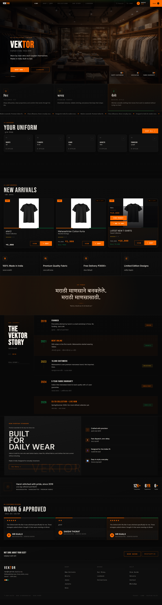
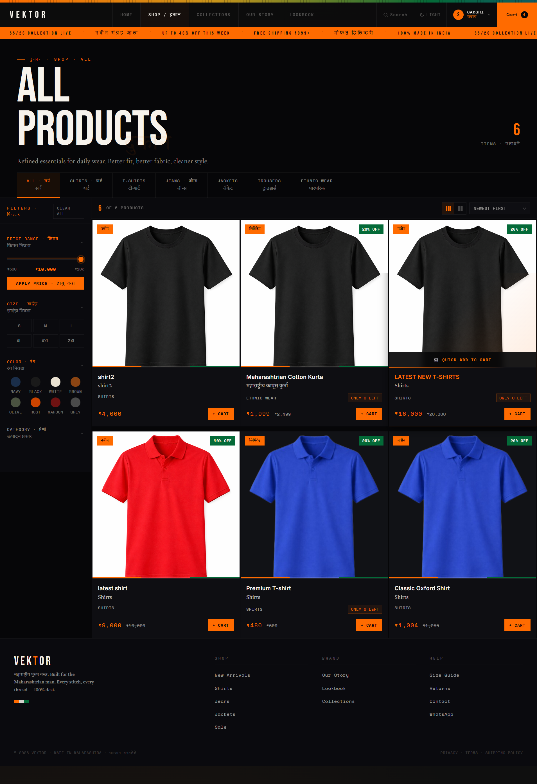
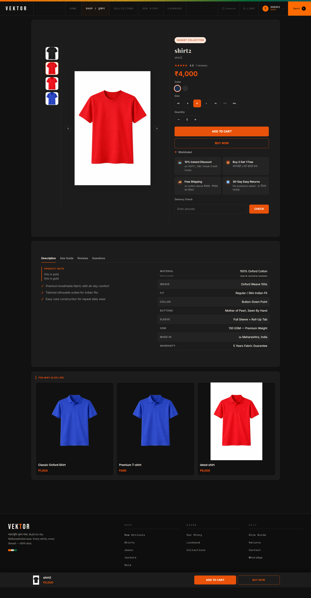
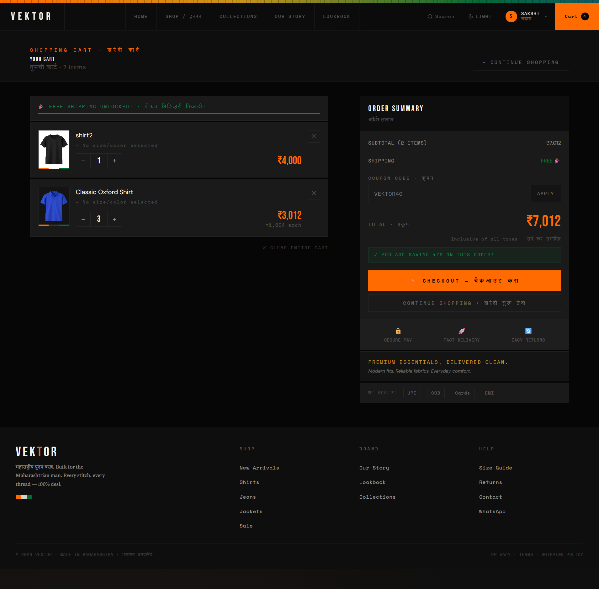
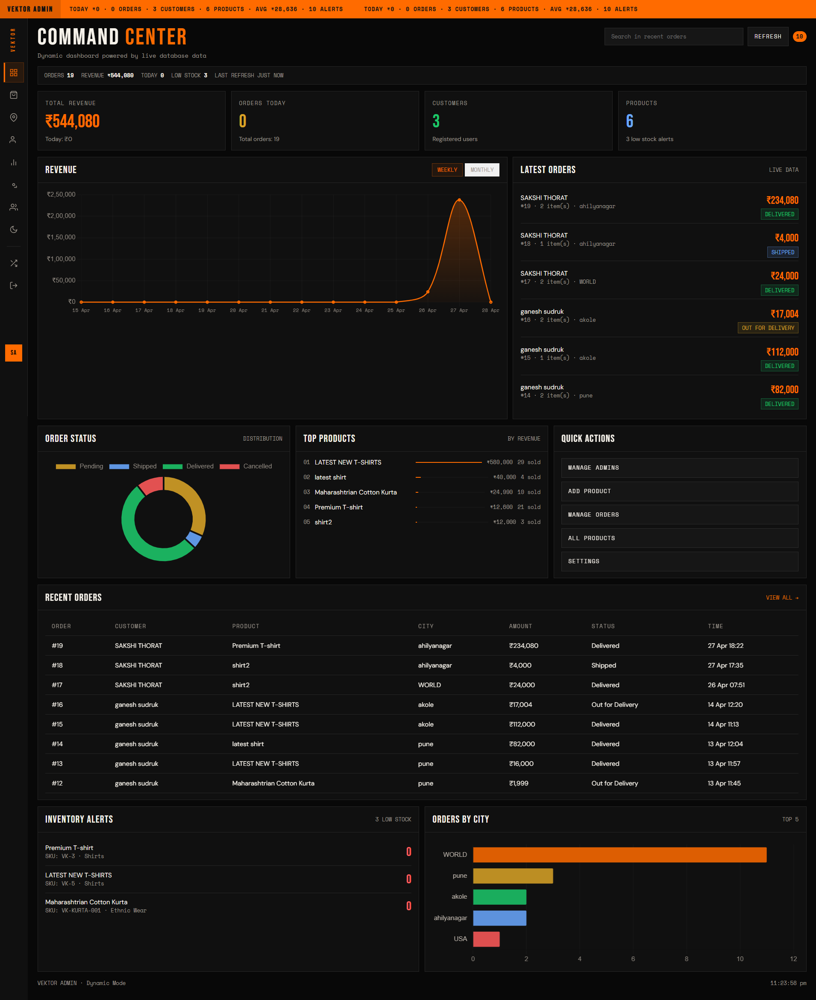

# Vektor Store 🛍️

Vektor Store is a full-stack e-commerce web application built using Python Flask and MySQL, designed to simulate a real-world online shopping platform.

---

## 🚀 Features

- Product listing with filters (price, size, category)
- Product detail page with size & color selection
- Add to cart functionality
- Checkout system (Cash on Delivery / UPI)
- User dashboard with order tracking
- Admin panel for product & order management
- Analytics dashboard for business insights

---

## 🛠 Tech Stack

- Backend: Python (Flask)
- Database: MySQL
- Frontend: HTML, CSS, JavaScript
- Version Control: Git & GitHub

---

## 📸 Screenshots

(Add your screenshots here)

---

## ⚠️ Note

This is a **demo version** of the project.  
Full production code is kept private.

---

## 📄 License

This project is protected under a custom license. Unauthorized use is not allowed.

---

## 📸 Screenshots

### 🏠 Homepage

### 🛍️ Product Listing

### 📦 Product Detail

### 🛒 Cart Page

### 📊 Admin Dashboard

---

## 👨‍💻 Author

Gaurav Thorat  
